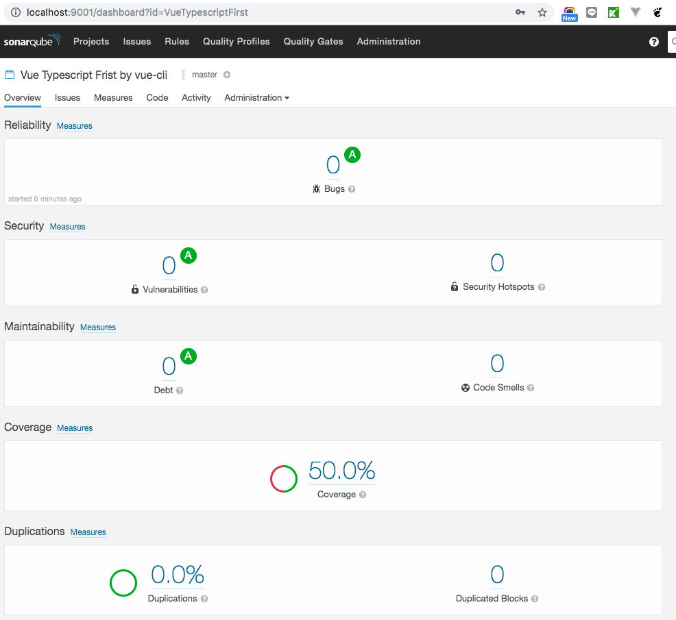

## init for upload test result to sonarqube server
```
npm i --save-dev jest-junit jest-serializer-vue jest-sonar-reporter jest-vue-preprocessor
```
```
npm i sonarqube-scanner -g
```
1 config sonar-project.properties
2 config script in package.json
```
"jest": "jest --coverage --logHeapUsage --maxWorkers=2 --no-cache --config jest.config.js"
```
3 
``` 
npm run jest 
```
4 
```
sonar-scanner
```
5 result in sonar server




more about e2e cypress with jest
https://github.com/bahmutov/cypress-and-jest